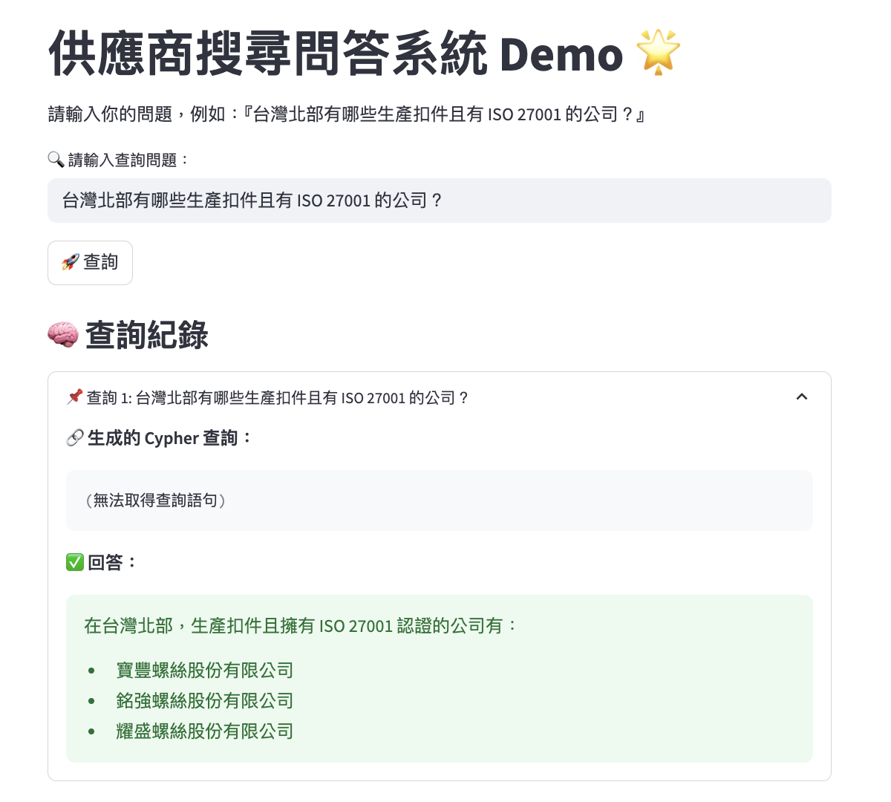

# 🔍 MVP 供應商問答系統（Graph RAG Demo）
這是一個結合 Neo4j + Langchain + Grok 模型（xAI）的問答系統。
使用者可透過自然語言查詢，如「北台灣有哪些生產扣件且具備 ISO 27001 的公司？」

>💡 MVP 發想源自對技術原理的好奇，參考論文〈Integrating Graph Retrieval-Augmented Generation With Large Language Models for Supplier Discovery〉，實作語意查詢與知識>圖譜整合流程，以加深對相關技術的理解。


---

## TECH

- [Langchain-XAI](https://github.com/langchain-ai/langchain-xai)
- [Neo4j](https://neo4j.com/)
- [Grok xAI 模型（透過 ChatXAI）](https://x.ai)
- [Streamlit](https://streamlit.io)

---

## 🚀 METHODS

1. 建立 `.env` 並填入：
```
   GROK_API_KEY=你的金鑰
   NEO4J_PASSWORD=你的neo4j密碼
```
2. 安裝必要套件:
```
pip install -r requirements.txt
```
3. 啟動前端：
```
streamlit run app.py
```

## FUTURE LOGS
* 增加UX - 顯示 GPT 生成的 Cypher 查詢（在 UI 中)
* 增加錯誤診斷輸出
* CHATGPT 建議
   * 建立 Prompt 評估機制
   * 後端 API 化（FastAPI or Flask）
   * 圖譜資料管理後台
   * CI/CD & Docker 化


## 參考文獻

- [Integrating Graph Retrieval-Augmented Generation With Large Language Models for Supplier Discovery](https://asmedigitalcollection.asme.org/computingengineering/article-abstract/25/2/021010/1210337/Integrating-Graph-Retrieval-Augmented-Generation?redirectedFrom=fulltext)